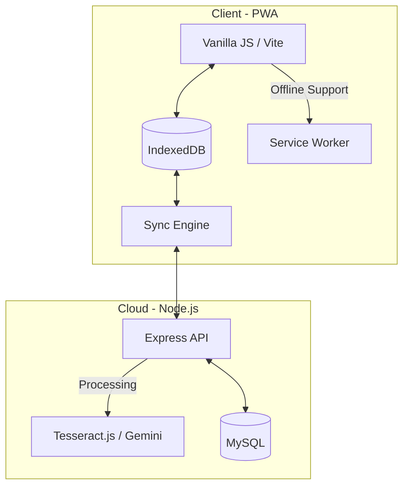

# Kirana POS - Technical Documentation

Comprehensive overview of the technology stack, architecture, and data flow for the Kirana POS Progressive Web Application (PWA).

## 🏗️ Architecture Overview
The system follows an **Offline-First PWA** architecture, ensuring shop operations can continue without internet connectivity, with background synchronization to a cloud backend.



---

## 💻 Tech Stack

### Frontend (Kirana-POS)
Designed for speed, reliability, and low data usage.
- **Language**: Vanilla JavaScript (ES6+ Modules).
- **Build Tool**: [Vite](https://vitejs.dev/) — High-performance frontend tooling.
- **Offline Storage**: **IndexedDB** — Transactional database for storing sales, stock, and customer data locally.
- **State Management**: Custom observable patterns and local state handlers.
- **PWA Features**:
  - **Service Workers**: For static asset caching and offline page loads.
  - **Web manifest**: For mobile installation ("Add to Home Screen").
- **Styling**: Vanilla CSS with a custom design system (Variables + Tokens).
- **Key Libraries**:
  - `qrcode`: Dynamic QR code generation for digital receipts and coupons.
  - `Chart.js`: (Planned/Integrated) for business analytics dashboards.

### Backend (Node.js)
Robust API layer handling data persistence and AI processing.
- **Runtime**: Node.js (v18+ recommended).
- **Framework**: [Express.js](https://expressjs.com/) — Fast, unopinionated web framework.
- **Database**: **MySQL** — Relational storage for multi-shop data integrity.
- **Authentication**:
  - **JWT (JSON Web Tokens)**: Secure stateless authentication for API requests.
  - **Bcrypt.js**: High-security password hashing.
- **AI & Intelligent Processing**:
  - **OCR (Local)**: [Tesseract.js](https://tesseract.js.org/) — 100% local, free AI bill scanning and data extraction.
  - **LLM Integration**: [Google Gemini AI](https://aistudio.google.com/) — Used for advanced business analytics and fallback complex bill parsing.
- **Notifications**:
  - **Nodemailer**: Automated daily summary reports via SMTP.
  - **Twilio**: (Staged) WhatsApp notification engine for business alerts.

---

## 🔄 Core Systems

### 1. Data Synchronization Engine
The heart of the application. It ensures data is never lost.
- **Idempotent Upserts**: Uses `INSERT ... ON DUPLICATE KEY UPDATE` to prevent duplicate records during sync retries.
- **Queue-Based**: Local changes are queued in IndexedDB and pushed to the backend whenever internet is available.
- **Conflict Resolution**: Client-side timestamps are used to ensure the most recent data wins.

### 2. AI Bill Scanner (100% Local)
A custom-built extraction engine designed for Indian bill formats.
- **Position-Aware Parsing**: Reconstructs table structures from OCR coordinates rather than just raw text.
- **Automated Mapping**: Extracts Supplier info (Name, GST, Mobile) and Bill Metadata (Date, Total, Items) automatically.
- **Zero-Manual-Entry**: Mapped data can be saved directly to inventory and supplier logs with one click.

### 3. Business Analytics
- **Daily Summaries**: Batch processing of sales to generate profit/loss reports.
- **Smart Coupons**: Logic-based voucher generation based on customer loyalty levels and purchase history.
- **Audit Logs**: Comprehensive event tracking for all sensitive operations (Edit stocks, delete sales, etc.).

---

## 🚀 Deployment
 
 ### Prerequisites
 - **Node.js** (v18+)
 - **MySQL** (Local or Cloud)
 - **PM2** (Process Manager)
 
 ### 1. Frontend Build
 ```bash
 cd kirana-pos
 npm install
 npm run build
 ```
 This generates the `dist` folder which is served by the backend.
 
 ### 2. Backend Configuration
 - Copy `.env.example` to `.env`.
 - Update `DB_HOST`, `DB_USER`, `DB_PASS`, and `DB_NAME`.
 - Add your `GEMINI_API_KEY`.
 
 ### 3. Start Production Server
 ```bash
 cd backend
 npm install
 npm install -g pm2
 pm2 start ecosystem.config.js --env production
 ```
 
 ### 4. Database Setup
 - Import `schema.sql` into your MySQL database.
 - Run any pending migrations from `migrate.sql` or `migrate_gemini.sql`.
